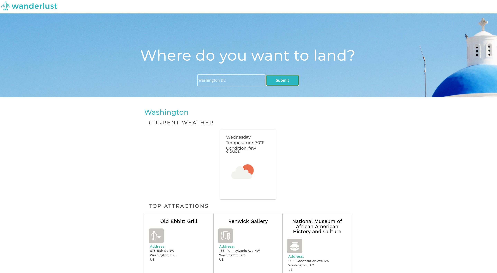

# Wanderlust
Link to project deployed with netlify. Live demo [here](https://the-weather-application-project.netlify.app/)

## Table of Content
* General Information
* Technologies Used
* Features
* Screenshot
* Installation and Setup Instructions
* Usage
* Project Status
* Room for Improvement
* Acknowledgements
* Contact

## General Information

Wanderlust is a weather application that deploys weather and forecast API's to fetch information about any city of your choice.

### Purpose of this project

To practice using API’s.

## Technologies Used

* HTML
* CSS
* JavaScript

## Features
* Search for your preferred country/city.
* Receive information abput the current weather, and top attractions.

## Screenshot
Version 1.0 

## Installation and Setup Instructions

1. Clone down this repository. You will need node and `npm` installed globally on your machine. 

2. Type 'npm i' to install packages. 

3. Run/open index.html in local browser and enjoy

## Usage

**Search**

* Search for country or city.

**Submit**

* Submit your input to receive weather and top attractions.

## Project Status
Project is: Completed

## Room for Improvement

* Provide more information about city/country of choice.

## Acknowledgements
* Many thanks to Codecademy.

## Contact
Created by Abeer Ahmed [LinkedIn profile](add url) - feel free to contact me.

